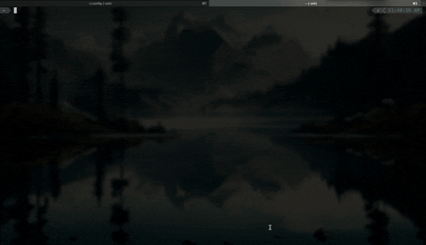

# Configuration

This repository contains my shell and editor configuration for MacOS. It is tested with [Neovim](https://neovim.io) v0.9.5.

<p align="center">
    
</p>

## Steps

The dotfiles are managed using the pattern described in [this article](https://www.atlassian.com/git/tutorials/dotfiles). You can use them by doing the following:

1. Install [Homebrew](https://brew.sh).
2. Install dependencies.

```bash
brew install git
brew install neovim
brew install npm
brew install python
brew install wget
```

3. Install dotfiles.

```bash
curl -Lks https://raw.githubusercontent.com/mattrrubino/.dotfiles/main/.install.sh | /bin/bash
```

4. Install [iTerm2](https://iterm2.com).
5. Install [Oh My ZSH](https://ohmyz.sh).
6. Install [Powerlevel10k](https://github.com/romkatv/powerlevel10k#oh-my-zsh).
7. Load `~/.config/iterm2/profile.json` in iTerm2.

## FAQ

**How do I recover my previous configuration files?**\
The dotfile installer script relocates existing configuration files to `~/.config-backup`.

**Why doesn't `debugpy` work?**\
If `debugpy` is not working, it means that Mason most likely installed it for the wrong version of Python. To fix this, run the following command:

```bash
python3 -m pip install debugpy
```

