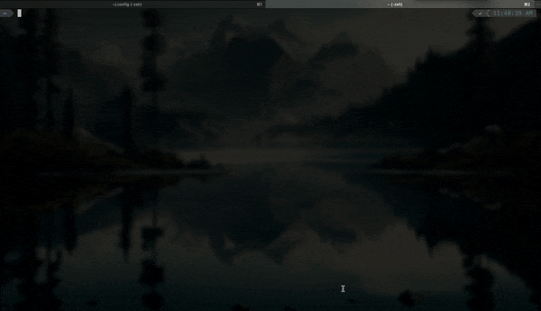

# Configuration

This repository contains my shell and editor configuration for MacOS. It is tested with [Neovim](https://neovim.io) v0.9.5.

<p align="center">
    
</p>

## Steps

1. Install [Homebrew](https://brew.sh).
2. Install dependencies.

```bash
brew install git
brew install neovim
brew install npm
brew install python
brew install wget
```

3. Create aliases (optional).

```bash
echo "alias python=python3" >> ~/.zprofile
echo "alias pip=pip3" >> ~/.zprofile
echo "alias vim=nvim" >> ~/.zprofile
```

4. Install [iTerm2](https://iterm2.com).
5. Load `profile.json` in iTerm2.
6. Install [Oh My ZSH](https://ohmyz.sh).
7. Install [Powerlevel10k](https://github.com/romkatv/powerlevel10k#oh-my-zsh).
8. Copy `nvim` into `~/.config`.

## FAQ

**Why doesn't `debugpy` work?**\
If `debugpy` is not working, it means that Mason most likely installed it for the wrong version of Python. To fix this, run the following command:

```bash
python3 -m pip install debugpy
```

